# FeedLink 社交系统（时间线 + 私信 + 通知中心）

一个基于 Go + Vue 的社交系统，当前已实现：
- 用户体系（注册/登录/JWT）
- 关注关系
- 动态发布与时间线（推拉混合）
- 点赞/评论/转发
- 私信会话 + WebSocket 实时消息
- 通知中心（点赞/评论/关注）
- RabbitMQ 异步分发（重试、DLQ、幂等）
- Redis 缓存与令牌桶限流

---

## 系统架构图

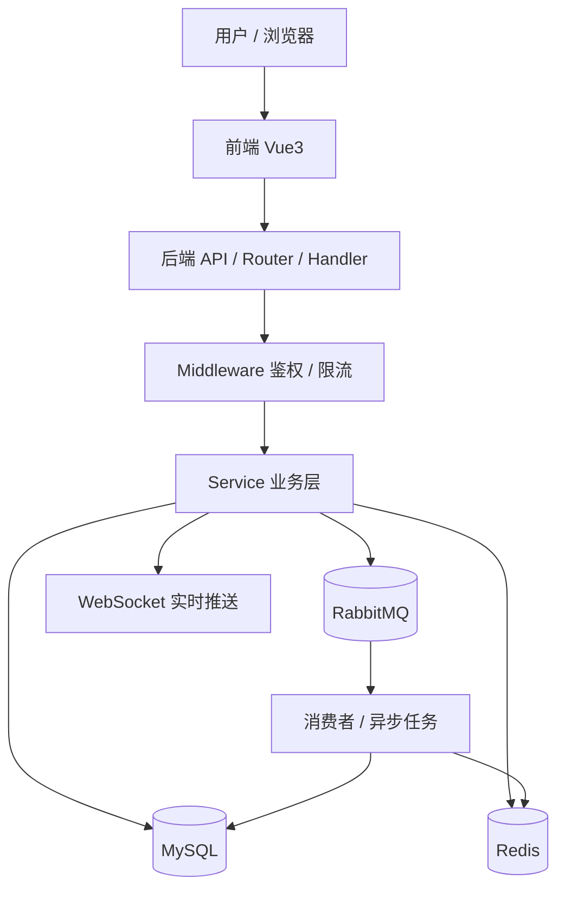

## 登录与鉴权流程

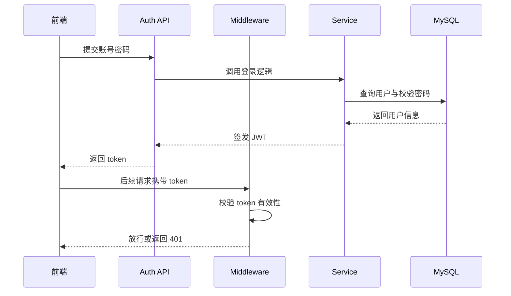

## 发布动态流程

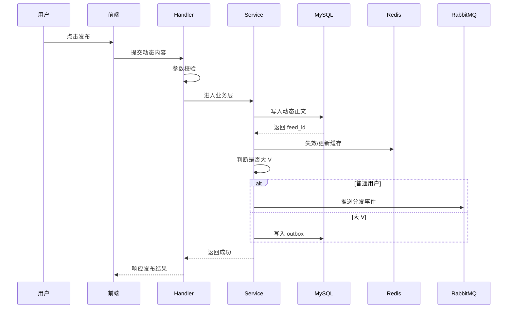

## 时间线推拉混合流程

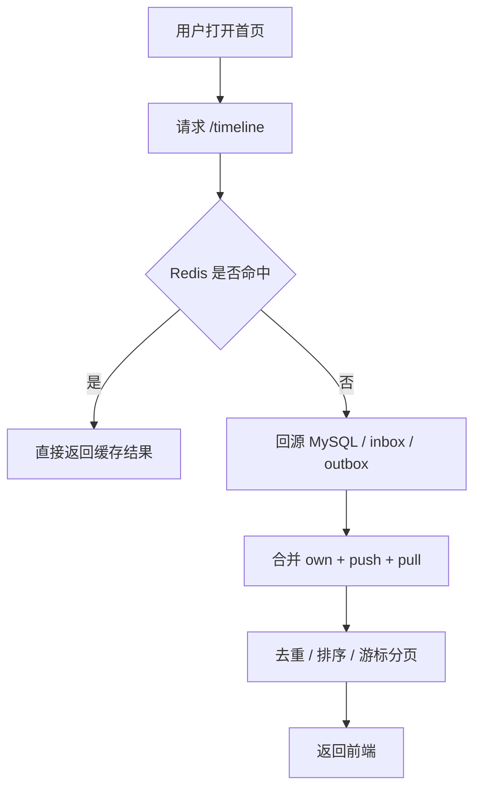

## 私信与实时消息流程

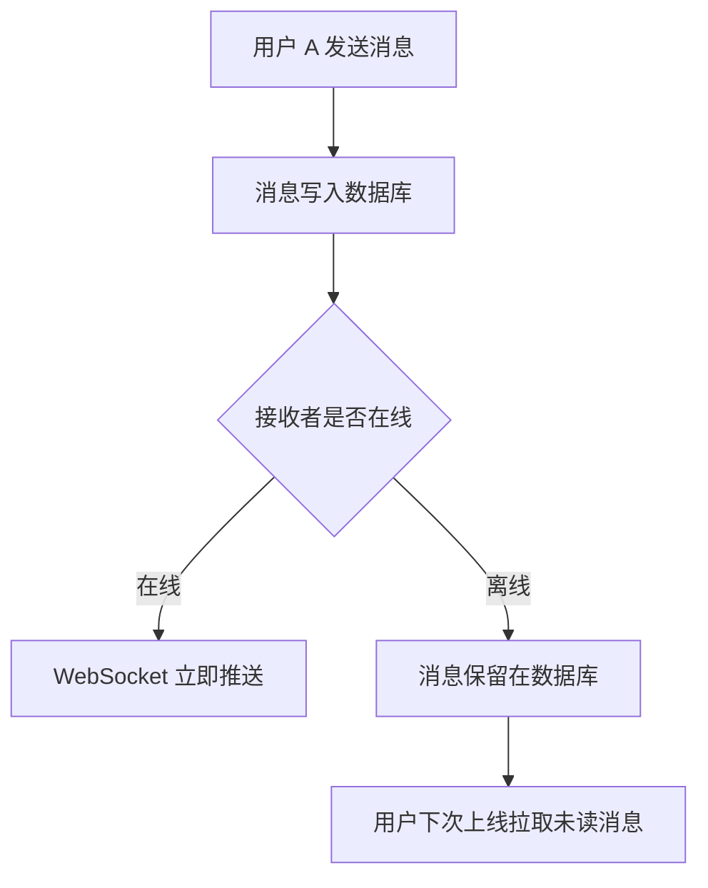

## MQ 重试与死信队列

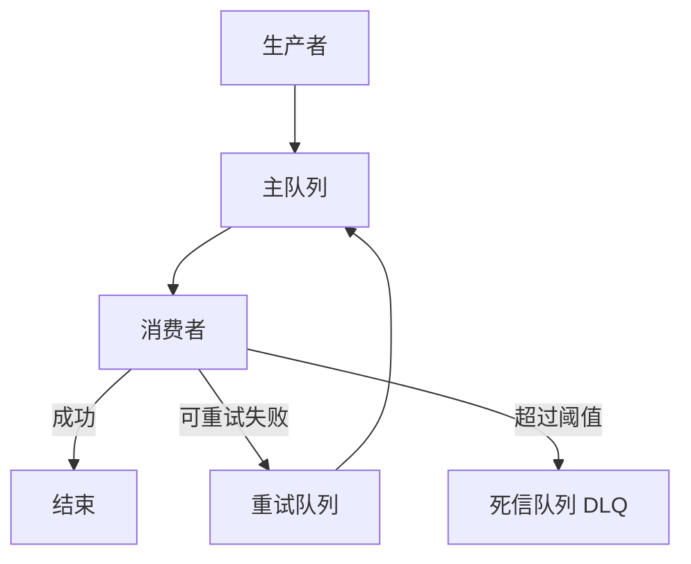

## 关注关系图

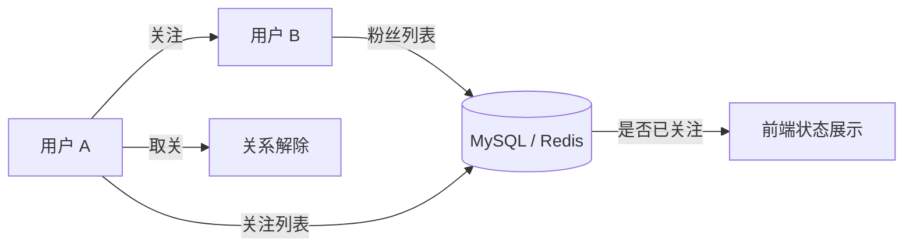

## 点赞 / 评论链路图

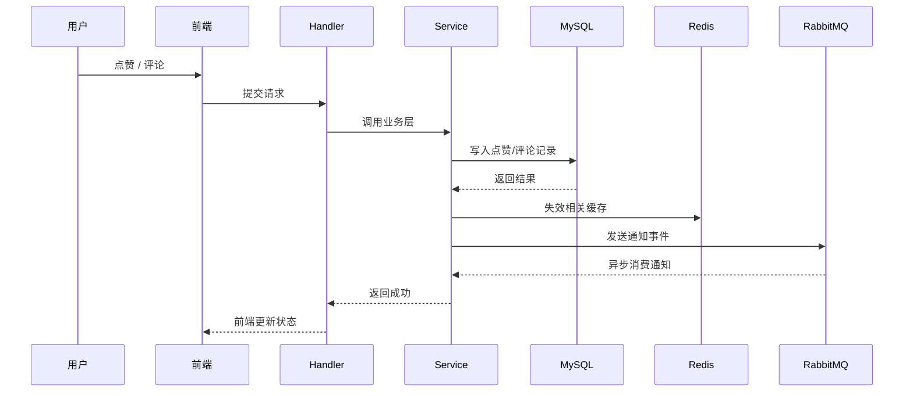

## Redis 缓存命中 / 回源图

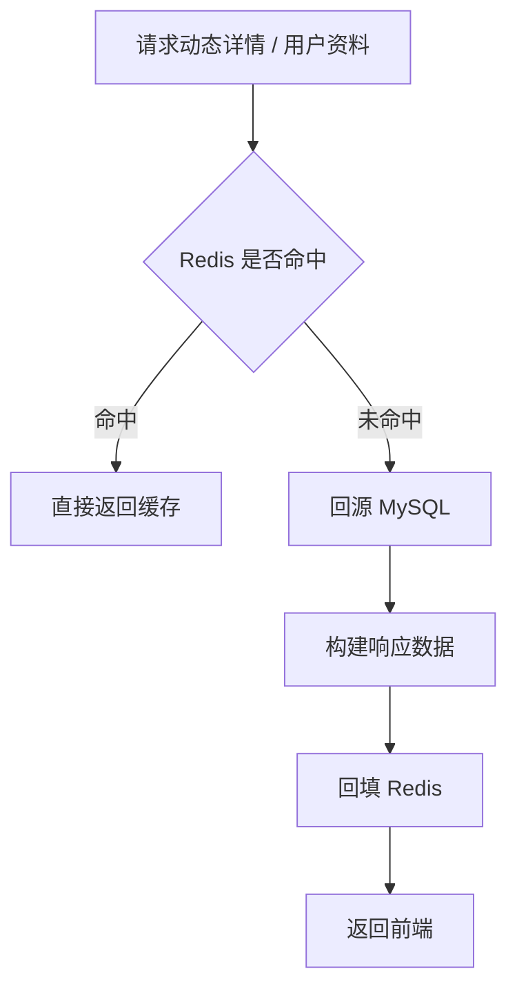

## 令牌桶限流图

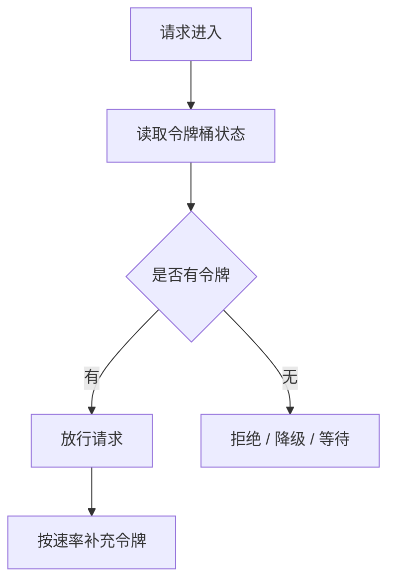

## 主要业务链路图

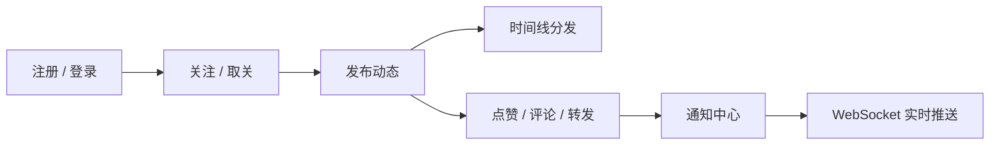

## 界面截图


## 技术栈

### 后端（`backend/`）
- Go 1.25+
- Gin
- GORM + MySQL
- Redis
- RabbitMQ
- JWT

### 前端（`frontend/`）
- Vue 3（Composition API）
- Vue Router
- Pinia
- Axios
- Element Plus
- Vite

---

## 当前核心功能（按模块）

### 1. 账号与用户
- 注册 / 登录（JWT）
- 获取当前用户资料、更新资料（昵称/头像/签名）
- 用户搜索
- 最近访客记录（visit）

### 2. 关注关系
- 关注 / 取关
- 粉丝/关注列表
- 关注关系缓存（Redis Set）

### 3. 动态系统
- 发布动态（文案/图片/视频）
- 转发动态
- 删除动态
- 点赞 / 取消点赞
- 评论 / 删除评论
- 动态详情

### 4. 时间线（核心）
- 推拉混合：
  - 普通用户写扩散（push -> inbox）
  - 大V读扩散（pull <- outbox）
- 聚合 own + push + pull 后去重排序
- 游标分页：`cursor / next_cursor / has_more`

### 5. 私信与实时消息
- 私信发送
- 会话列表与会话消息
- 未读计数
- WebSocket 实时推送（`message:new`）

### 6. 通知中心
- 通知类型：`like / comment / follow`
- 通知列表分页
- 未读统计
- 一键全部已读

### 7. 搜索中心
- 全局搜索入口
- 搜索结果页支持 Tab：
  - 用户
  - 动态

### 8. 运维小面板（前端）
- 前端提供 `/ops` 运维页面
- 可查看 MQ 熔断/降级关键指标
- 入口位于「设置 -> 运维面板」

---

## 可用性与高并发能力（已实现）

### 1) MQ 可靠性
- 主队列 + 重试队列 + 死信队列（DLQ）
- 失败重试（延迟重试）
- 超过重试次数进入 DLQ
- 消费幂等（Redis `SETNX + TTL`）

### 2) MQ 降级与熔断
- MQ 发布失败触发熔断（短期开路）
- 熔断期间降级为“仅写 outbox”，保障发布主链路
- 消费侧 DB timeline 写失败降级不阻断主分发

### 3) 缓存策略
- Feed 详情缓存
- 用户资料缓存
- TTL 随机抖动（防雪崩）
- `singleflight` 防缓存击穿（热点回源合并）
- 写操作后主动失效关键缓存

### 4) 索引优化
已在模型层补充核心索引：
- `feeds(created_at, user_id)`
- `likes(feed_id, user_id)`
- `comments(feed_id, created_at)`
- `messages(to_user_id, is_read, created_at)`

### 5) 搜索优化（Phase 1）
- 避免全表 `LIKE %keyword%`
- 改为前缀策略 `keyword%`（可利用索引）

### 6) 限流（令牌桶）
- Redis 令牌桶限流中间件
- IP 维度：登录/注册
- 用户维度：发布/转发/评论/私信
- 参数可在 `config.yaml` 配置（`rate_limit`）

---

## API 概览

### Auth
- `POST /api/auth/register`
- `POST /api/auth/login`

### User
- `GET /api/users/me`
- `PUT /api/users/me`
- `GET /api/users/me/visits`
- `GET /api/users/search`
- `GET /api/users/:id`

### Follow
- `POST /api/follow/:id`
- `DELETE /api/follow/:id`
- `GET /api/users/:id/followers`
- `GET /api/users/:id/following`

### Feed / Timeline
- `POST /api/feeds`
- `POST /api/feeds/repost`
- `DELETE /api/feeds/:id`
- `GET /api/feeds/:id`
- `GET /api/feeds/search`
- `GET /api/users/:id/feeds`
- `GET /api/timeline?cursor=0&page_size=20`

### Like / Comment
- `POST /api/feeds/:id/like`
- `DELETE /api/feeds/:id/like`
- `GET /api/feeds/:id/likes`
- `POST /api/feeds/:id/comments`
- `GET /api/feeds/:id/comments`
- `DELETE /api/feeds/:id/comments/:comment_id`

### Message / WS
- `POST /api/messages`
- `GET /api/messages/conversations`
- `GET /api/messages/:target_id`
- `GET /ws/messages?token=xxx`

### Notification
- `GET /api/notifications`
- `POST /api/notifications/read-all`

### Ops（观测）
- `GET /api/ops/mq/metrics`

---

## 项目结构

```text
feed/
├─ backend/
│  ├─ main.go
│  ├─ config.yaml
│  ├─ cache/
│  ├─ config/
│  ├─ handlers/
│  ├─ middleware/
│  ├─ models/
│  ├─ mq/
│  ├─ realtime/
│  ├─ repository/
│  ├─ router/
│  ├─ services/
│  └─ utils/
├─ frontend/
│  ├─ package.json
│  └─ src/
│     ├─ api/
│     ├─ components/
│     ├─ router/
│     ├─ stores/
│     └─ views/
└─ README.md
```

---

## 本地运行

### 1) 启动依赖
请先准备：
- MySQL
- Redis
- RabbitMQ

可使用：

```bash
docker compose up -d
```

### 2) 启动后端

```bash
cd backend
go mod tidy
go run main.go
```

默认：`http://localhost:8080`

### 3) 启动前端

```bash
cd frontend
npm install
npm run dev
```

---

## 配置说明（重点）

后端配置文件：`backend/config.yaml`

重点可调参数：
- `feed.*`：大V阈值、推拉边界、收发件箱大小
- `rabbitmq.*`：重试/DLQ/幂等 TTL
- `rate_limit.*`：令牌桶限流速率与突发容量

---

## 未来可继续增强
- 计数异步聚合（点赞/评论 Redis 累积后回刷 DB）
- Prometheus + Grafana 指标监控
- 更细粒度的熔断与降级开关
- 搜索升级到 FULLTEXT / ES

---

## License

MIT
