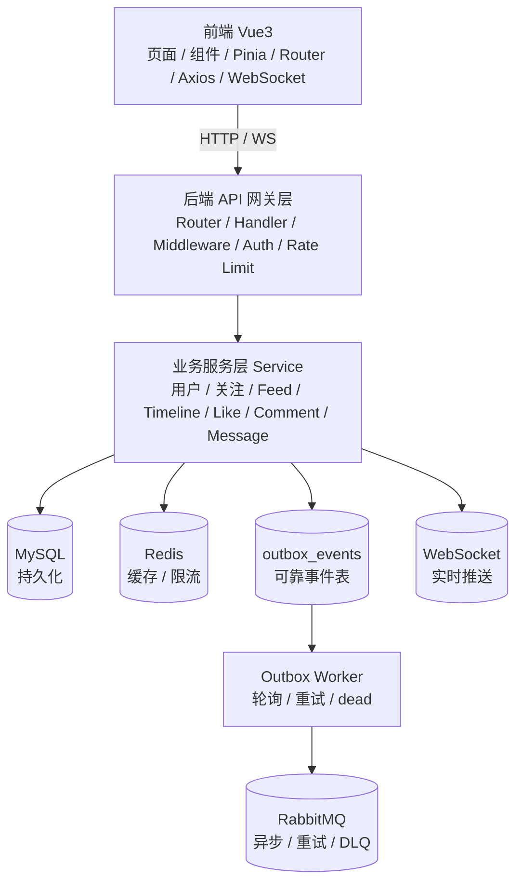
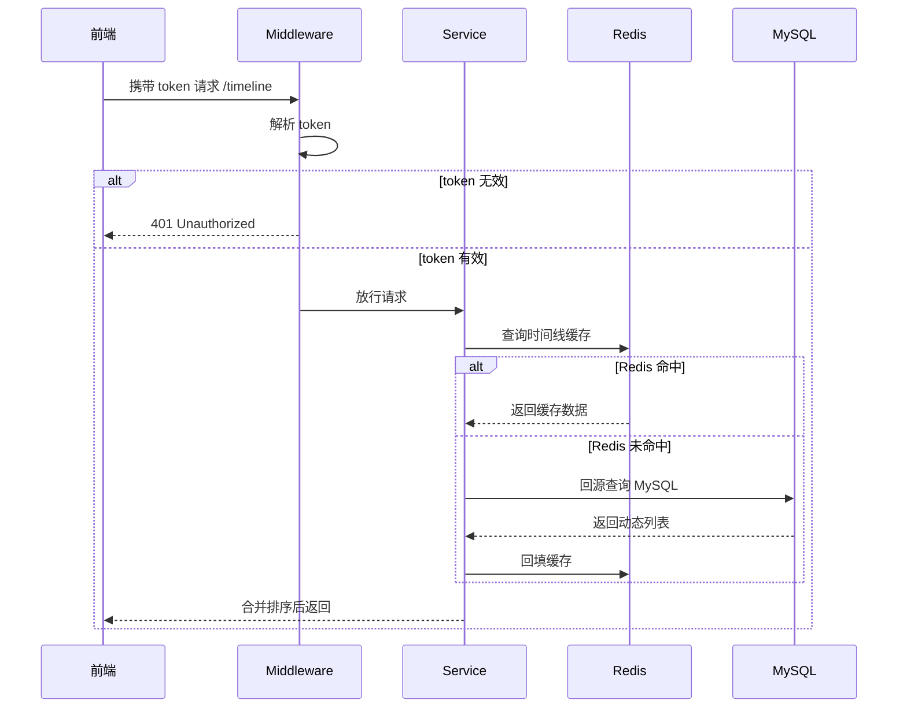
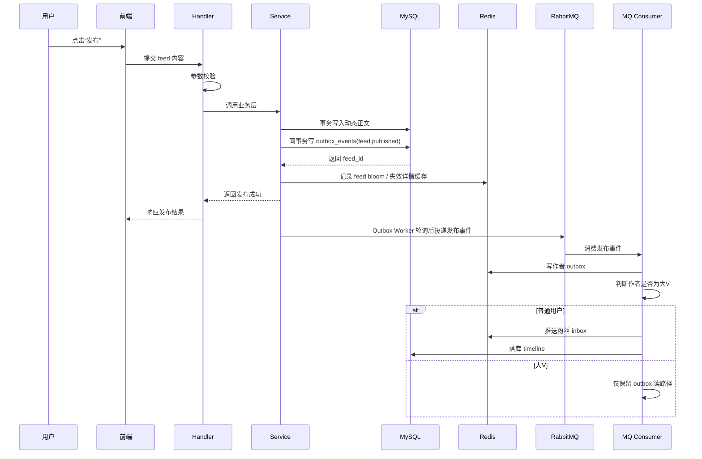
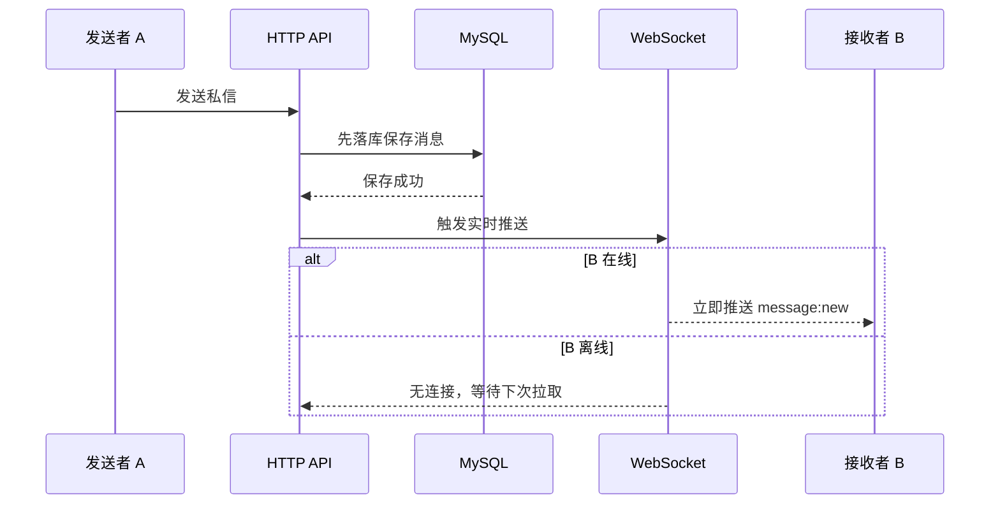
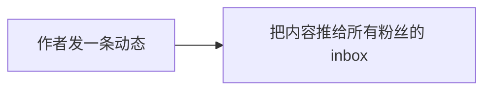
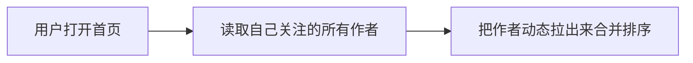
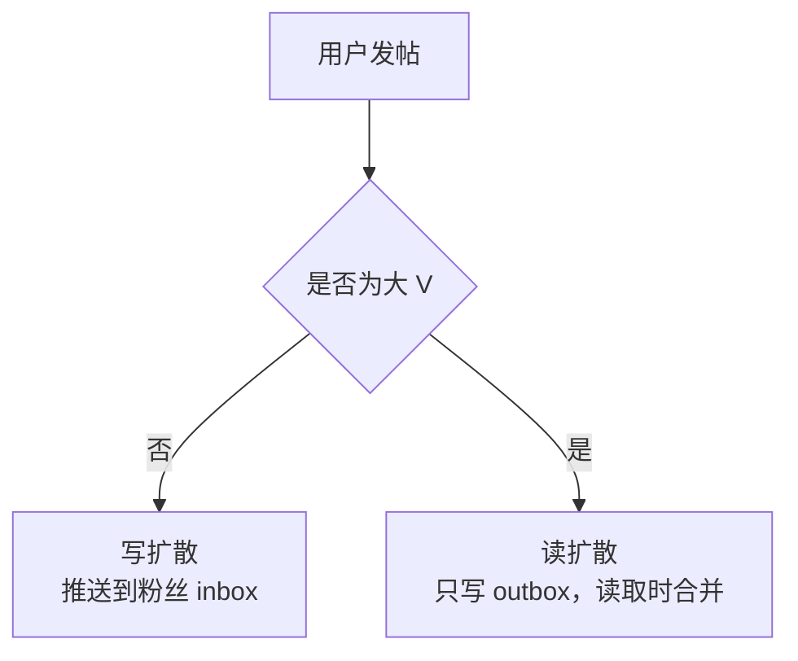
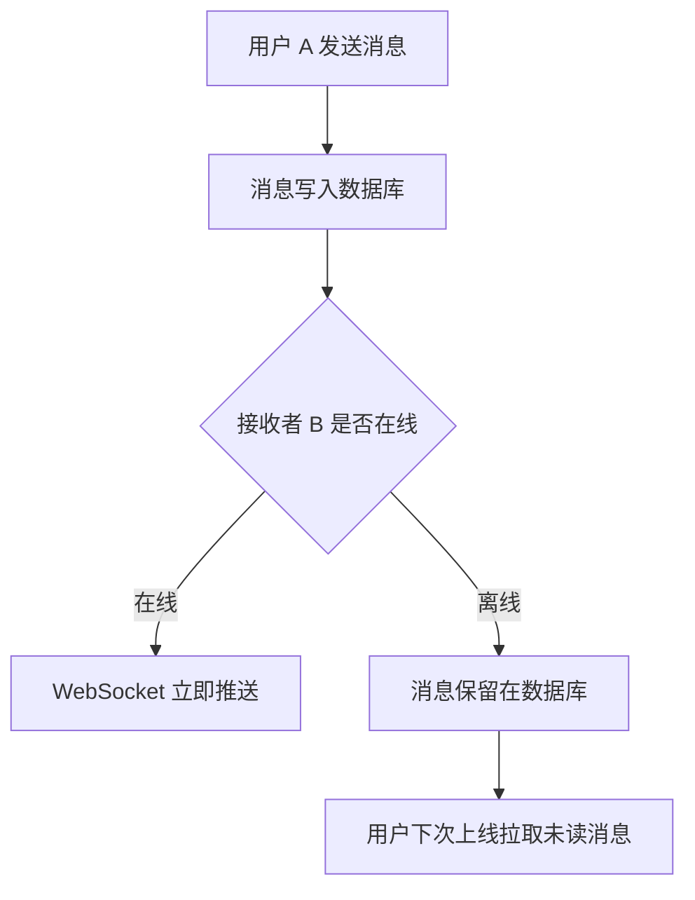
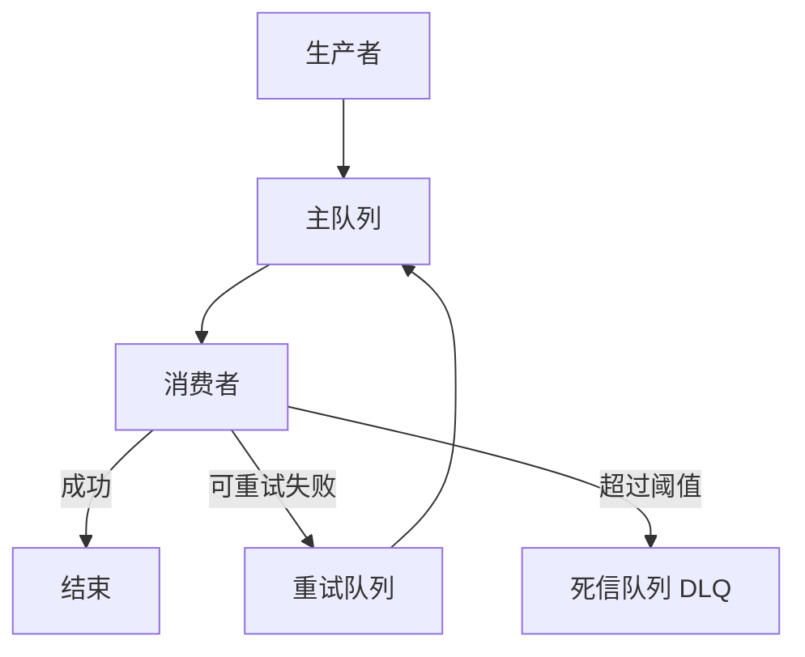

# Feed 项目学习手册（超详细版）

> 适用对象：准备系统学习、复盘实现、面试讲解、二次开发的人。
>
> 学习目标：不仅知道“功能怎么用”，更要知道“为什么这么设计”“底层原理是什么”“分层如何协作”。
>
> 更新时间：2026-04-18

---

## 0. 先建立整体认知

这个项目可以理解为一个“社交内容平台”的简化版，核心能力接近“小红书 / 微博 / 朋友圈”的组合：

- 用户登录注册
- 关注 / 粉丝关系
- 发布动态、点赞、评论、转发
- 时间线流（Feed / Timeline）
- 私信与 WebSocket 实时通信
- 通知中心
- Redis 缓存、限流、幂等
- Outbox 可靠事件表 + RabbitMQ 异步分发、重试、死信队列

你学习这个项目，不是只学 CRUD，而是学一套完整的后端工程思维：

1. **业务建模**：社交关系如何表达。
2. **分层设计**：接口层、业务层、数据层怎么协作。
3. **高并发处理**：缓存、限流、异步、重试怎么组合。
4. **稳定性设计**：幂等、降级、熔断、可观测怎么落地。
5. **实时通信**：WebSocket 为什么适合私信场景。

---

## 1. 项目全景图

### 1.1 整体架构图



### 1.2 你要记住的核心结论

- **MySQL** 负责“最终数据真相”。
- **Redis** 负责“快”。
- **Outbox** 负责“业务写库与异步投递的一致性”。
- **RabbitMQ** 负责“异步解耦”。
- **WebSocket** 负责“实时”。
- **Service 层** 负责“业务规则与流程”。
- **Handler 层** 负责“接收请求、参数校验、返回响应”。

---

## 2. 分层职责：每一层到底干什么

理解分层，是你读懂项目的第一步。

### 2.1 Handler / Controller 层

**职责**：
- 接收 HTTP 请求
- 解析参数、校验格式
- 调用业务层
- 统一输出响应

**不应该做什么**：
- 不要写复杂业务逻辑
- 不要直接拼 SQL
- 不要把缓存细节写在接口层

**类比**：
- Handler 就像“前台接待”，只负责接待、登记、转交。

### 2.2 Service 层

**职责**：
- 处理核心业务规则
- 决定先写库还是先写缓存
- 决定是否发 MQ
- 决定是否广播通知
- 保证幂等和一致性策略

**这是项目里最重要的一层**。

**类比**：
- Service 就像“项目经理”，负责协调所有环节完成任务。

### 2.3 Repository / DAO 层

**职责**：
- 封装数据库访问
- 组织查询条件
- 统一处理 ORM 操作

**优点**：
- 业务层不需要关心 SQL 细节
- 后续换存储方式更容易

**类比**：
- Repository 就像“仓库管理员”，负责拿货、放货、查库存。

### 2.4 Model / Entity 层

**职责**：
- 定义数据库表结构对应的数据模型
- 定义索引、字段、关系

**类比**：
- Model 就像“表格模板”，告诉系统数据长什么样。

### 2.5 Middleware 层

**职责**：
- 鉴权
- 限流
- 日志
- 统一 recover

**类比**：
- Middleware 就像“安检门”，请求必须先通过。

### 2.6 Cache 层

**职责**：
- 封装 Redis 读写
- 统一缓存键命名
- 控制过期时间
- 处理击穿、雪崩、穿透防护

### 2.7 MQ 层

**职责**：
- 处理异步任务
- 降低主链路耗时
- 做失败重试与死信兜底

### 2.8 Realtime / WebSocket 层

**职责**：
- 保持长连接
- 服务端主动推送
- 实现消息实时到达

---

## 3. 核心业务流程总览

下面先看“完整流程图”，后面再拆开讲。

### 3.1 用户登录后访问动态首页



### 3.2 用户发布动态的完整链路

> 当前实现采用“业务入库 + Outbox 可靠事件 + MQ consumer 分流”的模式：
> - `PublishFeed` 在同一个事务中写入动态和 `outbox_events`；
> - `OutboxService` 后台轮询待发送事件，投递到 RabbitMQ；
> - MQ consumer 负责判断大V/普通用户，并执行 inbox/outbox 分发；
> - 大V的读路径以 outbox 拉取为主，普通用户的读路径以 inbox 为主。



### 3.3 私信实时到达流程



---

## 4. 关键功能详解

## 4.1 用户体系：注册、登录、JWT

### 4.1.1 解决的问题

系统必须知道“谁在操作”。

没有身份认证，就无法做到：
- 谁能发动态
- 谁能删评论
- 谁能关注别人
- 谁能查看私信

### 4.1.2 登录流程

```text
输入账号密码
   │
   ▼
后端验证账号是否存在
   │
   ▼
比对密码哈希
   │
   ├─ 成功 → 签发 JWT
   └─ 失败 → 返回错误
```

### 4.1.3 JWT 的底层原理

JWT（JSON Web Token）本质上是一个**自包含的签名令牌**。

它通常由三部分组成：

```text
header.payload.signature
```

- **header**：说明算法类型
- **payload**：放用户信息、过期时间等声明
- **signature**：用密钥签名，防止篡改

#### 为什么 JWT 可以验证身份？

因为服务端拿到 token 后，会使用同样的密钥重新计算签名：

- 如果签名一致，说明 token 没被改过
- 如果不一致，说明 token 被篡改或伪造

#### JWT 的优点
- 无状态，适合分布式服务
- 便于前后端分离
- 性能好，不需要每次查 session

#### JWT 的缺点
- 一旦签发，服务端天然不容易立即失效
- token 泄露后风险较高
- 需要配合过期机制、刷新机制或黑名单机制

### 4.1.4 密码为什么不能明文存储

密码一旦明文存储，数据库泄露就会直接导致用户账号风险。

一般会使用：
- bcrypt
- scrypt
- argon2

#### 底层原理简述

这些算法不是简单加密，而是**单向哈希 + 强度增强**：
- 不可逆
- 带 salt
- 计算成本高，降低暴力破解速度

---

## 4.2 关注关系：社交图谱的基础

### 4.2.1 为什么关注关系重要

关注关系本质上决定了：
- 谁会看到谁的内容
- 谁的内容会被推送给谁
- 谁的通知要发送给谁

它是整个 Feed 分发系统的基础。

### 4.2.2 核心操作
- 关注
- 取关
- 查询是否关注
- 获取关注列表 / 粉丝列表

### 4.2.3 底层原理：为什么可用 Redis Set

Redis Set 适合存储“无序、去重”的关系集合。

例如：
- user A 关注了哪些人
- user B 的粉丝是谁

#### Set 的优势
- `SISMEMBER` 判断是否关注很快
- 自动去重
- 适合关系型集合查询

#### 为什么不直接只用 MySQL

MySQL 可以存，但高频查询如果全走数据库：
- QPS 会高
- 判断“是否已关注”会频繁扫索引
- 热门用户关系读取压力大

所以常见方案是：
- **MySQL** 保存最终关系
- **Redis** 保存热关系缓存

---

## 4.3 动态系统：发布、点赞、评论、转发

### 4.3.1 功能列表
- 发动态
- 看动态详情
- 点赞 / 取消点赞
- 评论 / 删除评论
- 转发
- 删除动态

### 4.3.2 发布动态流程

```text
用户提交内容
   │
   ▼
参数校验
   │
   ▼
写入 MySQL
   │
   ├─ 成功后更新/失效缓存
   ├─ 生成通知事件
   ├─ 更新时间线索引
   ▼
返回 feed_id
```

### 4.3.3 点赞为什么要做幂等

幂等的意思是：
> 同一个操作执行一次和执行多次，结果应尽量一致。

例如：
- 点赞按钮被连点
- 网络超时导致前端重复提交
- MQ 重试导致消息再次到达

如果没有幂等：
- 点赞数会重复增加
- 数据状态会错乱

### 4.3.4 幂等底层思路

常见做法：
- 数据库唯一约束（`feed_id + user_id`）
- Redis `SETNX`
- 业务状态机判断

#### 为什么唯一约束有效

数据库会强制保证：
- 同一用户对同一动态只能有一条点赞记录

这样即使上层重复请求，也会被数据库兜住。

### 4.3.5 评论分页为什么重要

评论量大时，如果一次性返回全部评论：
- 响应慢
- 内存压力大
- 前端渲染卡顿

所以要做分页。

### 4.3.6 为什么建议按时间倒序

用户通常最关心最新评论。

倒序能：
- 提升体验
- 减少首屏加载时间
- 适合持续新增数据的场景

---

## 5. 时间线系统：本项目最核心的部分

时间线就是“用户打开首页时看到的内容流”。

这是社交产品最核心、最容易出性能问题的模块。

### 5.1 两种经典方案

## 方案 A：纯推（写扩散）



#### 优点
- 读快
- 首页加载快

#### 缺点
- 写放大严重
- 大 V 粉丝多时，单次写入成本爆炸

---

## 方案 B：纯拉（读扩散）



#### 优点
- 写轻
- 维护简单

#### 缺点
- 读时成本高
- 首页打开慢
- 聚合逻辑复杂

---

### 5.2 当前项目采用：推拉混合（Hybrid Fanout）

这是非常经典且实用的折中策略。



### 5.3 为什么要这样做

#### 普通用户
粉丝不多，发帖推送成本可控。

#### 大 V 用户
粉丝很多，如果强行写扩散，会导致：
- 写入变慢
- MQ 堆积
- DB 压力爆发

所以大 V 更适合：
- 只存自己的 outbox
- 用户打开首页时再拉取

### 5.4 底层原理：推扩散与拉扩散本质是什么

#### 推扩散
作者发布时，把内容复制到粉丝侧。

本质是：
- **写时增加成本**
- **读时减少成本**

#### 拉扩散
用户读取时再聚合内容。

本质是：
- **写时减少成本**
- **读时增加成本**

### 5.5 游标分页为什么比 offset 分页更适合时间线

#### offset 分页问题
例如：
- 第 1 页：`offset 0 limit 20`
- 第 2 页：`offset 20 limit 20`

问题是：
- 数据插入后页码会漂移
- 越往后 offset 越慢
- 大数据量下性能差

#### 游标分页优点
- 稳定
- 适合连续加载
- 性能更好

### 5.6 游标分页的底层思路

游标通常基于：
- 时间戳
- 自增 ID
- 复合排序键

例如：
- 先按 `created_at desc`
- 同时间再按 `id desc`

这样能保证排序稳定，避免重复和漏数据。

---

## 6. 私信与 WebSocket：为什么要用长连接

### 6.1 私信的核心诉求

私信不是“偶尔刷新就行”的场景，而是：
- 低延迟
- 主动通知
- 用户在线时立即看到

### 6.2 WebSocket 与 HTTP 的区别

#### HTTP
- 请求/响应模式
- 客户端主动发起
- 适合查询和短连接操作

#### WebSocket
- 长连接
- 连接建立后双向通信
- 服务端可以主动推送消息

### 6.3 为什么私信适合 WebSocket

因为聊天场景需要：
- 快速送达
- 实时反馈
- 在线状态感知

### 6.4 私信完整流程



### 6.5 底层原理：为什么要“先落库再推送”

先落库的好处：
- 消息不会因为推送失败而丢失
- 可以追溯历史
- 支持离线拉取

所以“数据库是真相，推送只是通知”。

---

## 7. 通知中心：异步生成更合理

### 7.1 通知来源
- 被点赞
- 被评论
- 被关注

### 7.2 为什么通知适合异步

通知是“衍生数据”，不是主交易链路。

例如用户点赞一条动态时：
- 主链路是“点赞成功”
- 通知是“给作者发一条提醒”

如果通知失败，不应该导致点赞失败。

### 7.3 异步化的底层意义

异步化的本质是：
- 把“必须立即完成的事”与“可以稍后完成的事”分开
- 降低主请求耗时
- 提高系统吞吐量

### 7.4 MQ 在通知里的作用

```text
点赞成功
   │
   ▼
发送消息到 MQ
   │
   ▼
通知消费者消费
   │
   ▼
生成通知记录 / 更新未读数 / 推送实时消息
```

---

## 8. Redis：缓存、限流、幂等、热点保护

Redis 是这个项目非常重要的中间层。

### 8.1 为什么 Redis 很快

底层原因：
- 内存读写快
- 数据结构简单高效
- 单线程事件循环减少锁竞争（现代 Redis 也有多线程网络模型优化）

### 8.2 常见用途
- 用户资料缓存
- 动态详情缓存
- 关注关系缓存
- 限流计数器
- 幂等键
- 热点数据保护

### 8.3 缓存三大问题

#### 1）缓存穿透
请求一个根本不存在的数据，缓存和数据库都查不到。

**问题**：大量无效请求穿透到 DB。

**解决**：
- 缓存空值
- 参数校验
- 布隆过滤器

#### 2）缓存击穿
某个热点 key 过期瞬间，大量请求同时打到 DB。

**解决**：
- singleflight / mutex
- 热点 key 预热
- 逻辑过期

#### 3）缓存雪崩
大量 key 同时过期，DB 被瞬间打爆。

**解决**：
- TTL 加随机抖动
- 分批过期
- 限流降级

### 8.4 单飞（singleflight）的底层思想

单飞的意思是：
- 同一时刻相同 key 的多个请求，只让一个请求去查数据库
- 其他请求等待结果

这能有效减少热点并发下的重复回源。

### 8.5 Redis 限流底层原理：令牌桶

令牌桶是一种经典限流算法。

```text
令牌按固定速率产生
   │
   ▼
请求来了先拿令牌
   │
   ├─ 拿到 → 放行
   └─ 拿不到 → 拒绝/排队
```

#### 令牌桶适合什么场景
- 允许一定突发流量
- 控制平均速率
- 适合 API 防刷

#### 为什么不用“直接计数”就完事
计数法简单，但对流量突发的控制没那么灵活。令牌桶更接近真实系统对“平滑控制”的需求。

---

## 9. RabbitMQ：异步、解耦、重试、死信队列

### 9.1 为什么需要 MQ

当一个请求要做很多事时，如果全部同步执行：
- 响应慢
- 链路长
- 某个依赖失败会拖垮整条请求

MQ 的作用是把部分任务拆出去异步做。

### 9.2 MQ 的底层价值

#### 1）削峰填谷
高峰时先把消息堆到队列，消费者慢慢处理。

#### 2）系统解耦
生产者不用关心消费者是谁。

#### 3）失败重试
临时错误可自动重试。

### 9.3 重试队列与死信队列



### 9.4 为什么需要死信队列

因为有些消息不能无限重试，否则会：
- 占用系统资源
- 产生消息风暴
- 影响正常消息处理

死信队列用于：
- 人工排查
- 补偿处理
- 记录故障

### 9.5 幂等消费为什么重要

MQ 默认可能出现：
- 重投
- 重试
- 重复消费

如果消费者不幂等，可能导致：
- 重复发通知
- 重复更新计数
- 重复写 timeline

所以消费者必须设计成“重复执行也安全”。

---

## 10. 数据一致性：你必须理解的工程现实

### 10.1 为什么一致性很难

因为这个系统里同时存在：
- MySQL
- Redis
- MQ
- WebSocket

它们不是一个事务里的。

### 10.2 常见策略

#### 强一致
所有操作必须同时成功。

缺点：性能差、复杂度高、可用性差。

#### 最终一致
允许短时间不一致，但最终收敛。

这是互联网系统最常见的做法。

### 10.3 本项目常见做法
- 主数据先落 MySQL
- 缓存异步失效或更新
- 通知通过 MQ 生成
- 推送失败不影响落库

### 10.4 底层思维

你要接受一个现实：
> 分布式系统不是“绝对一致”，而是“尽量正确 + 可恢复 + 可补偿”。

---

## 11. 数据库设计：表、索引、查询性能

### 11.1 为什么索引这么重要

索引本质上是数据库的“加速目录”。

没有索引，数据库可能要全表扫描；有了合适索引，能大幅降低查找成本。

### 11.2 常见索引策略

#### 1）联合索引
适合：
- `where + order by`
- 多条件过滤

#### 2）覆盖索引
查询字段都包含在索引中，减少回表。

#### 3）唯一索引
适合幂等与防重复。

### 11.3 为什么要避免深分页

`offset` 越大，数据库要跳过的数据越多，性能越差。

所以时间线、评论等连续列表更推荐游标分页。

### 11.4 事务为什么要尽量短

事务太长会：
- 占锁时间长
- 增加死锁概率
- 降低并发能力

所以要把事务只包住必要的 SQL，不要把网络调用放进事务里。

---

## 12. 前端分层：页面、状态、请求、实时通信

### 12.1 前端结构理解

- `views`：页面级
- `components`：复用组件
- `api`：接口封装
- `stores`：全局状态
- `router`：路由控制

### 12.2 前端职责

前端不是只负责“展示”，它还负责：
- 管理登录态
- 请求接口
- 错误提示
- 页面间状态共享
- WebSocket 连接与消息展示

### 12.3 Pinia 的作用

Pinia 用于管理全局状态，例如：
- 当前用户信息
- token
- 未读消息数
- 主题模式

### 12.4 为什么要把请求封装在 api 层

如果每个页面都手写请求：
- 重复代码多
- 错误处理分散
- token 处理难统一

封装后可以：
- 统一加请求头
- 统一处理 401
- 统一返回格式

---

## 13. 一次完整请求是怎么走的

下面用“发动态”举例。

```text
[页面点击按钮]
   │
   ▼
[前端校验输入]
   │
   ▼
[Axios 发 HTTP 请求]
   │
   ▼
[后端 Router 匹配接口]
   │
   ▼
[Middleware 鉴权/限流]
   │
   ▼
[Handler 解析参数]
   │
   ▼
[Service 执行业务逻辑]
   │
   ├─ Repository 操作 MySQL
   ├─ Cache 更新/失效
   ├─ MQ 发布事件
   └─ Realtime 推送通知
   ▼
[统一响应前端]
   │
   ▼
[前端更新页面状态]
```

### 13.1 这条链路里每层的价值

- Router：找到正确入口
- Middleware：做通行检查
- Handler：处理请求格式
- Service：核心决策
- Repository：执行持久化
- Cache/MQ/WS：提升性能与体验

---

## 14. 图解：大 V 与普通用户的时间线差异

### 14.1 普通用户

```text
普通用户发帖
   │
   ▼
推送到粉丝 inbox
   │
   ▼
粉丝打开首页直接读 inbox
```

### 14.2 大 V 用户

```text
大 V 发帖
   │
   ▼
只写自己的 outbox
   │
   ▼
粉丝打开首页时再拉取大 V 内容
```

### 14.3 这样设计的原因

普通用户粉丝少，适合提前分发。

大 V 粉丝多，如果提前推送会导致写入爆炸。

所以这不是“偷懒”，而是非常典型的**性能折中设计**。

---

## 15. 底层原理小抄：你必须理解的概念

### 15.1 什么是缓存命中率

命中率 = 请求中直接从缓存拿到数据的比例。

命中率越高：
- DB 压力越小
- 响应越快

### 15.2 什么是最终一致性

允许短暂差异，但系统最终会自动收敛到正确状态。

### 15.3 什么是幂等

重复执行同一操作，结果不应发生错误累积。

### 15.4 什么是削峰填谷

把瞬时高峰流量转移到队列中慢慢消化。

### 15.5 什么是回源

缓存没有命中时，回到数据库获取真实数据。

### 15.6 什么是热 key

访问特别频繁的 key。

热 key 容易造成：
- 缓存压力集中
- 单点热点
- 击穿风险

---

## 16. 学习顺序建议：怎么学最有效

### 第一阶段：先跑通

目标：知道系统怎么启动、怎么登录、怎么发帖。

你要做的事：
1. 启动 MySQL / Redis / RabbitMQ
2. 启动后端
3. 启动前端
4. 完成注册、登录、发动态、关注、看时间线

### 第二阶段：看主链路

目标：把“发动态到时间线”这条链路吃透。

重点看：
- Handler
- Service
- Repository
- Cache
- MQ

### 第三阶段：看难点

重点理解：
- 推拉混合时间线
- 游标分页
- 幂等
- 重试 / DLQ
- 限流

### 第四阶段：看工程能力

重点理解：
- 日志
- 指标
- 健康检查
- 优雅停机
- 故障排查

---

## 17. 可直接背诵的面试表达

### 17.1 项目概述

“这是一个 Go + Vue3 的社交内容系统，核心功能包括用户、关注、动态、时间线、私信和通知。后端通过 Redis 做缓存和限流，通过 RabbitMQ 做异步分发与解耦，私信用 WebSocket 实现实时通信，整体是一个兼顾性能和工程可靠性的社交平台。”

### 17.2 时间线亮点

“时间线采用推拉混合策略，普通用户采用写扩散，大 V 采用读扩散，从而平衡写放大和读放大问题。读取侧使用游标分页，避免 offset 深分页带来的性能和一致性问题。”

### 17.3 稳定性亮点

“系统通过幂等、重试、死信队列、限流和缓存降级来保证可用性；同时对热点数据做缓存保护，避免击穿和雪崩。”

### 17.4 实时通信亮点

“私信场景采用 WebSocket，因为它支持长连接和服务端主动推送，更适合低延迟通信；消息先落库再推送，保证数据可追溯和离线可恢复。”

---

## 18. 建议你边学边画的 6 张图

如果你真的想学透，建议手画这 6 张图：

1. **整体架构图**：前端、后端、MySQL、Redis、MQ、WS 的关系。
2. **登录流程图**：注册、登录、JWT 校验。
3. **发动态流程图**：写库、缓存、MQ、通知。
4. **时间线流程图**：推扩散、拉扩散、游标分页。
5. **私信流程图**：落库、在线推送、离线拉取。
6. **故障处理图**：限流、降级、重试、DLQ、排障。

画图的价值是：
- 帮你建立系统感
- 帮你面试时更容易讲清楚
- 帮你发现逻辑漏洞

---

## 19. 你可以如何继续深入

如果你已经看懂这份文档，下一步建议你继续做三件事：

### 19.1 从“使用者”变成“实现者”

挑一条链路自己重写一遍，比如：
- 点赞
- 评论
- 时间线
- 私信

### 19.2 从“看代码”变成“画流程”

每读一个模块，都试着回答：
- 输入是什么
- 输出是什么
- 中间依赖什么
- 失败怎么办
- 如何扩展

### 19.3 从“功能思维”变成“稳定性思维”

任何功能都要问自己：
- 会不会重复提交
- 会不会超时
- 会不会雪崩
- 会不会不一致
- 出错后如何恢复

---

## 20. 最终总结

学习这个项目，真正的重点不是“我会点哪个按钮”，而是你能不能把下面这四件事讲清楚：

1. **业务是怎么流转的**
2. **每一层为什么要这么分**
3. **性能问题怎么被解决**
4. **出故障后系统如何自我保护**
